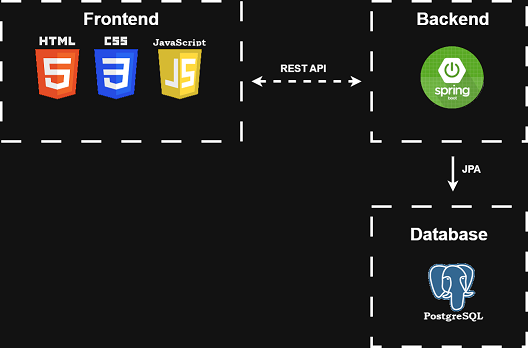
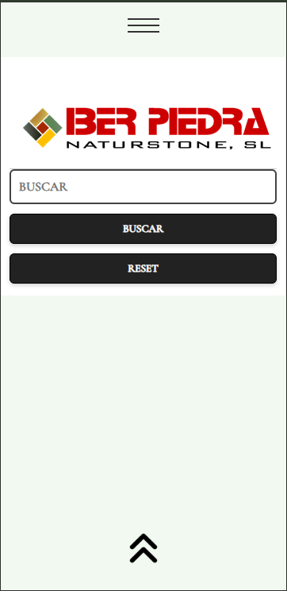
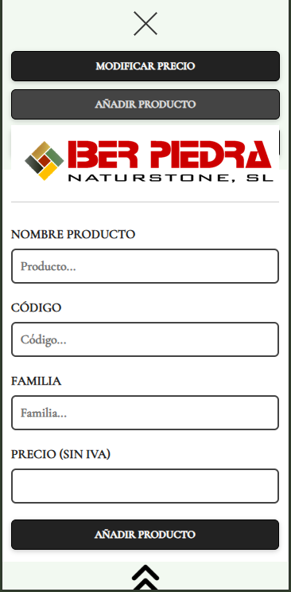
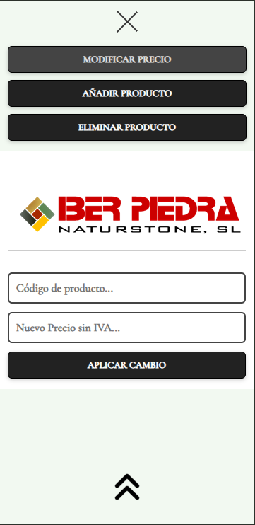
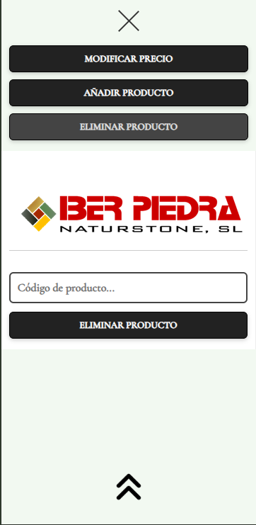

# 🧱 Iberpiedra Buscador

Iberpiedra Buscador is a full-stack web application developed for internal use in a family-owned company. The application allows managing a stone products catalog through a web interface, providing full CRUD functionality.

This project is part of my personal portfolio and represents my **first complete independently developed application**, covering frontend development, backend API design, database integration, deployment, and production configuration.

---

## 🌐 Live Demo

**Frontend (GitHub Pages):**  
https://robmaasmarin.github.io/iberpiedra-buscador/

**Backend API (Render):**  
https://iberpiedra-backend.onrender.com

---

## ✨ Features

- 🔍 Search products by code
- 🔎 Search products by name
- 📋 View product details
- ➕ Add new products
- ✏️ Update product prices
- ❌ Delete products
- 🌍 Frontend–backend communication via REST API
- 🔓 No authentication (internal company use)

---

## 🛠️ Tech Stack

### Frontend
- **Languages:** HTML5, CSS3, Vanilla JavaScript
- **Deployment:** GitHub Pages

### Backend
- **Language:** Java 17
- **Framework:** Spring Boot
- **Data Access:** Spring Data JPA
- **API:** REST
- **Build Tool:** Maven

### Database
- **Production:** PostgreSQL (Supabase)
- **Local Development:** MySQL (MySQL Workbench)

### Deployment
- **Frontend:** GitHub Pages
- **Backend:** Render
- **Database:** Supabase (PostgreSQL)
- **Previous platforms explored:** Railway, AlwaysData

---

## 🧩 Architecture Overview




The application follows a classic client–server architecture with full separation between frontend, backend, and database layers.
```
Frontend (HTML / CSS / JavaScript)
    ↓
REST API (Spring Boot)
    ↓
PostgreSQL Database
```

The frontend is fully decoupled and communicates with the backend via HTTP requests.

---

## 🗂️ Backend Structure
```text
com.empresa.backend_productos
├── controller
│   └── ProductoController.java
├── modelo
│   └── Producto.java
├── repository
│   └── ProductoRepository.java
├── CorsConfig.java
└── BackendProductosApplication.java
```

---

## 🔗 API Endpoints

| Method | Endpoint | Description |
|--------|----------|-------------|
| `GET` | `/producto` | API status message |
| `GET` | `/producto/buscar?codigo=` | Search product by code |
| `GET` | `/producto/buscar-por-nombre?descripcion=` | Search products by name |
| `GET` | `/producto/buscar-por-id?id=` | Get product by ID |
| `POST` | `/producto/producto` | Create a new product |
| `PUT` | `/producto/id/{id}` | Update product price |
| `DELETE` | `/producto/eliminar-por-id?id=` | Delete product |

---

## 🗃️ Product Model
```java
{
  "id": Long,
  "codigo": String (unique),
  "descripcion": String,
  "familia": String,
  "pvp": Double (price without VAT),
  "pvp_con_iva": Double (price with VAT)
}
```

---

## 📸 Screenshots

### Product Search


### Add Product Form


### Update Price Form


### Delete Product Form


---

## 🔐 Security

> **Note:** This application does not implement authentication or authorization. It is intended for internal company use, with access controlled externally.

---

## 🚀 What I Learned

- Building a complete CRUD application from scratch
- Developing REST APIs with Spring Boot
- Working with Spring Data JPA and relational databases
- Migrating from MySQL to PostgreSQL for production
- Configuring CORS for frontend–backend communication
- **Exploring and comparing multiple hosting platforms:** Deployed the application across Railway, AlwaysData, Render (backend), Supabase (database), and GitHub Pages (frontend), learning about their features, pricing models, and free tier limitations
- Managing application migrations and database transfers between different hosting providers
- Deploying static frontends on GitHub Pages
- Deploying backend services on Render
- Managing PostgreSQL databases on Supabase
- Structuring and delivering a real-world full-stack project independently

> **This was my first fully independent project involving frontend, backend, database, and deployment.**

---

## 🔮 Possible Improvements

- Authentication and role-based access control
- Input validation and improved error handling
- Pagination and advanced search filters
- Product category management
- UI/UX refinements with modern framework (React/Vue)

---

## 👨‍💻 Author

**Developed by Roberto Abelleira Pesqueira**  
Portfolio project demonstrating full-stack development skills.

---

## 📄 License

This project is for academic and portfolio purposes.